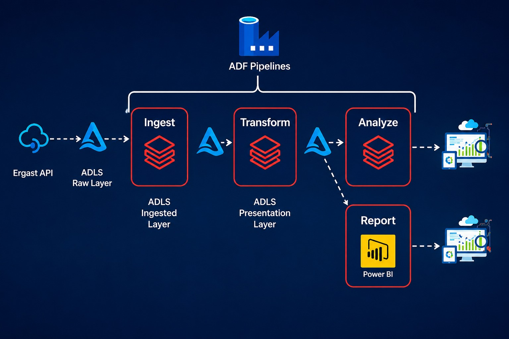
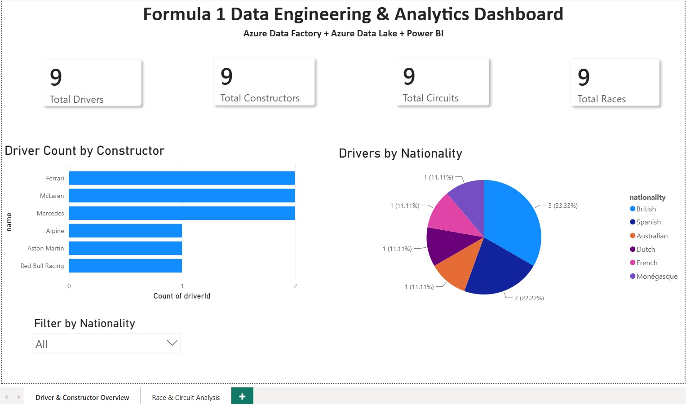
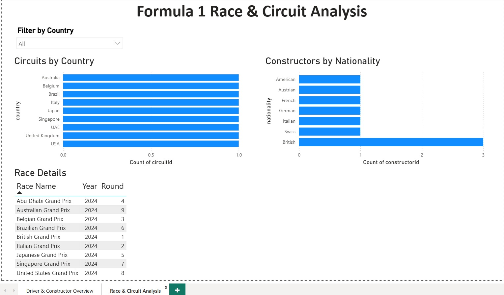
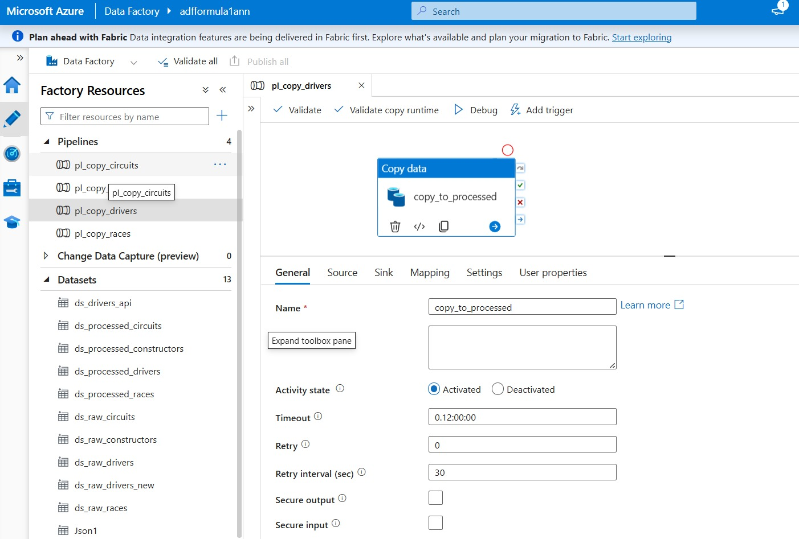
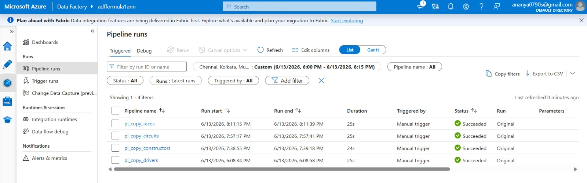
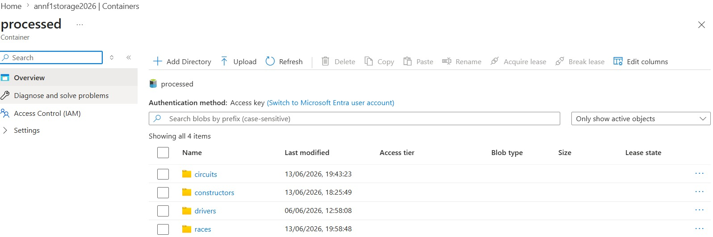

# Formula 1 Data Engineering & Analytics Project

## Overview

This project demonstrates an end-to-end Data Engineering and Analytics solution built on Microsoft Azure and Power BI using Formula 1 racing data.

The solution extracts Formula 1 data from the Ergast API, stores it in Azure Data Lake Storage (ADLS), processes it through Azure Data Factory (ADF) pipelines, and visualizes insights through interactive Power BI dashboards.

The project showcases key Data Engineering concepts including data ingestion, cloud storage, data transformation, pipeline orchestration, and business intelligence reporting.

---

## Project Architecture



### Data Flow

1. Formula 1 data is extracted from the Ergast API.
2. Raw JSON files are stored in Azure Data Lake Storage (Raw Layer).
3. Azure Data Factory pipelines ingest and process the data.
4. Processed datasets are stored in the Presentation Layer.
5. Power BI connects to the processed data and generates analytical dashboards.

---

## Technologies Used

### Cloud & Data Engineering

* Microsoft Azure
* Azure Data Factory (ADF)
* Azure Data Lake Storage Gen2 (ADLS Gen2)

### Data Sources

* Ergast Formula 1 API
* JSON Files

### Analytics & Visualization

* Microsoft Power BI

### Version Control

* Git
* GitHub

---

## Dataset

The project uses Formula 1 datasets containing:

### Drivers

* Driver ID
* Driver Name
* Nationality
* Constructor Association

### Constructors

* Constructor Name
* Nationality

### Circuits

* Circuit Name
* Country
* City

### Races

* Race Name
* Circuit ID
* Year
* Round

---

## Azure Data Factory Pipelines

The solution includes dedicated pipelines for each dataset:

* Drivers Pipeline
* Constructors Pipeline
* Circuits Pipeline
* Races Pipeline

Each pipeline performs:

* Data extraction from source JSON/API
* Data movement to ADLS
* Processing and storage in the presentation layer

---

## Data Lake Structure

### Raw Layer

Stores source JSON files directly from ingestion.

```text
raw/
├── drivers
├── constructors
├── circuits
└── races
```

### Processed Layer

Stores curated datasets used for analytics.

```text
processed/
├── drivers
├── constructors
├── circuits
└── races
```

---

## Power BI Dashboard

### Page 1: Driver & Constructor Overview

Key Metrics:

* Total Drivers
* Total Constructors
* Total Circuits
* Total Races

Visualizations:

* Drivers per Constructor
* Driver Nationality Distribution
* Nationality Filter

### Page 2: Race & Circuit Analysis

Visualizations:

* Circuits by Country
* Constructors by Nationality
* Race Details Table
* Country Filter

---

## Dashboard Screenshots

### Driver & Constructor Overview



### Race & Circuit Analysis



---

## Project Screenshots

### Azure Data Factory Pipeline



### Successful Pipeline Execution



### Azure Data Lake Storage



---

## Key Learnings

Through this project, I gained practical experience in:

* Azure Data Factory pipeline development
* Azure Data Lake Storage management
* JSON data processing
* Cloud-based data engineering workflows
* Data modeling in Power BI
* Interactive dashboard creation
* GitHub project documentation

---

## Author

**Ananya S**

Aspiring Data Engineer | Data Analyst

GitHub: https://github.com/ananya03ann

LinkedIn: https://www.linkedin.com/in/ananyas03
